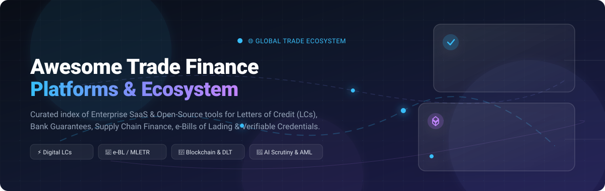

# Awesome-Trade-Finance-Platform 🌐💼

  

  
  
  
  
  
  

---

## 🚀 Top Trade Finance Platforms &amp; Digital Ecosystem

> 📌 **A curated directory of enterprise SaaS solutions, fintech platforms, open-source Letter of Credit (LC) workflows, smart contracts, electronic bills of lading (eBL), and verifiable credentials for global trade digitisation.**

**Focused on:** *Letters of Credit (LCs), Bank Guarantees & Standby LCs, Documentary Collections, Supply Chain Finance (SCF), Electronic Bills of Lading (e-BL / MLETR), Trade-Based Anti-Money Laundering (TBAML), and Multi-Bank Corporate Networks.*

**Last updated:** August 2026

---

## 📖 Overview

Global **Trade Finance** facilitates trillions of dollars in cross-border commerce annually. This repository tracks notable enterprise **SaaS platforms** and **open-source developer tooling** modernizing trade operations:
- 🏛️ **Instrument Processing:** Automating Letters of Credit, Guarantees, Sureties, and Documentary Collections.
- ⚡ **Supply Chain Finance:** Dynamic discounting, receivables financing, invoice discounting, and pre/post-shipment liquidity.
- 📜 **Digital Original Documents:** UNCITRAL MLETR-compliant digital negotiable instruments, e-Bills of Lading, and cryptographic document provenance.
- 🤖 **AI &amp; Document Automation:** Automated examination of trade documents against ICC rules (UCP 600, ISBP 745, URC 522) with real-time sanctions screening.
- 🔗 **Blockchain &amp; DLT Interoperability:** Multi-bank distributed ledgers, verifiable credentials, and decentralized identity for cross-border ecosystems.

---

## 📑 Table of Contents

- [🏢 SaaS &amp; Enterprise Platforms](#-saas--enterprise-platforms)
- [💻 Open-Source GitHub Projects](#-open-source-github-projects)
- [💡 Additional Frameworks &amp; Standards](#-additional-frameworks--standards)
- [⭐ Star History](#-star-history)
- [🤝 How to Contribute](#-how-to-contribute)
- [⚖️ Disclaimer](#️-disclaimer)

---

## 🏢 SaaS &amp; Enterprise Platforms

Enterprise-grade trade finance platforms sorted descending by company size (annual revenue / institutional valuation):

| Platform | Company Size (Revenue / Valuation) | Key Capabilities &amp; Focus | Pricing (Starting Tier / Commercial Model) | Free Tier / Free Trial Limits |
| :--- | :--- | :--- | :--- | :--- |
| **[Infor Nexus (GT Nexus)](https://www.infor.com/)** | **~$3.2 Billion – $3.4 Billion** *(Annual Revenue)* | 📦 Multi-enterprise supply chain orchestration, real-time logistics tracking, pre/post-shipment financing, and digital buyer-supplier collaboration. | Enterprise cloud subscription tiered by gross merchandise value (GMV) / transaction volume & ERP connectors | **No Free Tier:** No free trial; interactive live sandbox demo and solution design assessment available via Infor sales |
| **[Finastra Trade Innovation](https://www.finastra.com/)** | **~$1.8 Billion – $1.9 Billion** *(Annual Revenue)* | 🏛️ Comprehensive corporate & bank trade finance system handling Letters of Credit, Guarantees, Collections, and Open Banking APIs. | Custom enterprise software license & annual SaaS maintenance contract (tailored to bank asset tier & transaction volume) | **No Free Tier:** Live environment requires commercial licensing; 30–60 day guided sandbox / PoC available on request for qualified institutions |
| **[Komgo](https://www.komgo.io/)** | **~$1.0 Billion** *(Estimated Valuation / Major Institutional Network)* | 🛢️ Commodity trade finance network, digital LC negotiation, document authenticity verification (Trakk), and multi-bank credit facilities. | Annual SaaS subscription model per modular package (Konsole, Market, Check, Trakk); Counterparty/secondary market viewing is free | **Free Counterparty Access:** Counterparty document reception and public verification are free forever; 14–30 day guided enterprise pilots |
| **[Surecomp (Rivo / DOKA)](https://www.surecomp.com/)** | **~$80 Million – $120 Million** *(Estimated Annual Revenue)* | 🤝 Cloud-native collaborative ecosystem connecting corporates and banks for Letters of Credit, Guarantees, and document workflows. | Free Starter plan ($0) for base connectivity; Paid Business & Enterprise tiers priced on annual institutional subscription / volume tiers via sales quote | **Free Starter Tier:** Free forever plan with basic counterparty connectivity and manual LC/guarantee tracking (advanced automation & multi-entity require paid tiers) |
| **[China Systems Eximbills](https://www.chinasystems.com/)** | **~$50 Million – $80 Million** *(Estimated Annual Revenue)* | ⚙️ Global back-office trade processing engine used by 150+ financial institutions for documentary credits, trade loans, and collections. | Enterprise core banking license + annual maintenance tier based on branch network & transaction throughput | **No Free Tier:** No self-service free trial; evaluation access provided via guided POC/sandbox during vendor RFP stage |
| **[Contour (acquired by Xalts)](https://www.contour.network/)** | **~$40 Million – $60 Million** *(Institutional Backing / Xalts Ecosystem)* | 🌐 Digital Letter of Credit network connecting global trade banks, buyers, and sellers with embedded infrastructure APIs. | Infrastructure license / annual network participation fee via Xalts embedded trade finance APIs | **No Free Tier:** Closed network / private permissioned access; evaluation via custom Xalts developer sandbox upon partnership approval |
| **[Traydstream](https://www.traydstream.com/)** | **~$35 Million+** *(Total Capital Raised, Series B)* | 🤖 AI-driven trade document scrutiny against ICC rules (UCP 600, ISBP) with automated compliance, sanctions screening, and OCR. | Modular enterprise SaaS subscription with tiered per-document extraction & validation pricing | **No Self-Service Free Trial:** Direct proof-of-concept (PoC) processing evaluation with sample trade document batches upon request |
| **[Enigio (trace:original)](https://www.enigio.com/)** | **~$15 Million+** *(Institutional Funding & Convertible Capital)* | 📜 Cryptographic digital original documents for electronic bills of lading (eBL), promissory notes, and guarantees with legal enforceability. | Self-service starting at ~€5–€25 per digital original document; prepaid bundle packages and Enterprise node subscriptions available | **Free Tier:** 1 free digital original document on initial registration via online channel; free forever public verification & recipient transfers |
| **[TradeSun](https://www.tradesun.com/)** | **~$6 Million – $10 Million** *(Estimated Annual Revenue)* | 🛡️ Cognitive AI platform for real-time trade compliance, TBAML detection, dual-use goods screening, and automated document extraction. | Annual SaaS enterprise subscription tiered by trade document volume and module selection | **No Free Tier:** No free-forever tier; interactive guided demo and custom batch data evaluation available upon vendor consultation |
| **[Coriolis Technologies](https://www.coriolis.tech/)** | **~$5 Million** *(Estimated Annual Revenue / Specialized Analytics)* | 📊 Geopolitical and multilateral trade data analytics, SME supply chain risk scoring, and sustainable ESG trade finance metrics. | Annual institutional subscription / data API tier based on query volume and analytics seats | **No Free Tier:** Access restricted to enterprise data feeds; 14-day sample dataset evaluation & product demo on inquiry |

---

## 💻 Open-Source GitHub Projects

Open-source repositories, DLT frameworks, smart contracts, and developer tooling for trade finance, sorted descending by GitHub star count:

| Project | Stars | Focus &amp; Description | Tech Stack / Architecture |
| :--- | :--- | :--- | :--- |
| **[Hyperledger Fabric](https://github.com/hyperledger/fabric)** |  | 🏢 Enterprise-grade permissioned distributed ledger framework widely used as the core infrastructure for banking trade consortiums. | Go, Docker, Raft, gRPC |
| **[Corda](https://github.com/corda/corda)** |  | 🏦 Privacy-focused distributed ledger platform specifically engineered for financial agreements, tokenized trade assets, and multi-bank settlements. | Kotlin, Java, JVM |
| **[TradeTrust / OpenAttestation](https://github.com/TradeTrust/tradetrust-website)** |  | 📜 Singapore IMDA reference implementation for verifiable documents and electronic transferable records (e-BL) under UNCITRAL MLETR. | TypeScript, React, Ethereum |
| **[TradeTrust CLI](https://github.com/TradeTrust/tradetrust-cli)** |  | 🛠️ CLI utility for issuing, signing, wrapping, and verifying decentralized trade documents and OpenAttestation certificates. | Node.js, TypeScript, Ethers.js |
| **[TradeTrust Verification Engine](https://github.com/TradeTrust/tt-verify)** |  | 🔍 Core SDK for verifying document integrity, issuer identity, and Ethereum revocation status for trade documents. | TypeScript, JSON-LD, Web3 |
| **[Hyperledger Trade Finance Logistics](https://github.com/HyperledgerHandsOn/trade-finance-logistics)** |  | 🚢 End-to-end Letter of Credit, bill of lading exchange, and proof-of-shipment application on Hyperledger Fabric. | Hyperledger Fabric, Node.js, Express |
| **[Smart Bank LC Workflow](https://github.com/ac12644/Smart-Bank-LC-Workflow)** |  | ⚡ Smart contract implementation of a modern Letter of Credit lifecycle between applicant, issuing bank, and beneficiary. | Solidity, Hardhat, Web3.js |
| **[Corda Letter of Credit CorDapp](https://github.com/clydedacruz/LetterOfCredit)** |  | 🤝 CorDapp demonstrating complete Letter of Credit state machine across buyer, seller, and advising/issuing bank nodes. | Corda, Kotlin, Java |
| **[Solidity Letter of Credit](https://github.com/kyriediculous/LetterOfCredit)** |  | 🔒 Ethereum smart contract framework for LC issuance, conditional escrow release, and bill of lading presentation. | Solidity, Truffle, JavaScript |
| **[Validity Labs TradeManager](https://github.com/validitylabs/TradeManager)** |  | 📦 Supply chain & trade escrow management system orchestrating multi-party goods handover and payment release. | Solidity, Node.js, Web3 |

---

## 💡 Additional Frameworks &amp; Standards

- 📋 **ICC Rules &amp; Standards:** Uniform Customs and Practice for Documentary Credits (UCP 600), International Standby Practices (ISP98), Uniform Rules for Collections (URC 522), and eUCP Version 2.0.
- 📜 **Model Law on Electronic Transferable Records (MLETR):** Legal enabling framework adopted by the UNCITRAL for paperless electronic bills of lading and promissory notes.
- 🆔 **W3C Verifiable Credentials &amp; DIDs:** Decentralized identity standards applied to customs declarations, certificates of origin, and inspection certificates.
- 📡 **SWIFT MT700 / ISO 20022:** Standardized messaging formats (e.g., `tsmt`, `pain`, `camt`) for interbank trade finance messaging and payment initiation.

---

## 📈 Star History

---

## 🤝 How to Contribute

1. 🍴 Fork the repository.
2. 📝 Add or update entries in `README.md` (maintain standard table and badge formatting).
3. 🔎 Ensure descriptions are factual, pricing is specified, and links resolve to official repositories/websites.
4. 🚀 Submit a Pull Request with a clear description of changes.

---

## ⚖️ Disclaimer

- ⚠️ This is a **community-curated index** for informational and educational purposes — not financial, legal, or investment advice.
- 🛡️ Trade finance operations involve strict regulatory standards, negotiable instrument titles, and counterparty compliance. Always perform independent technical and compliance due diligence before deploying trade finance systems.

---

  <b>Made with ❤️ for trade finance professionals, banking technologists, fintech developers, and supply chain innovators.</b> 
  Let's build transparent, interoperable, and paperless global trade networks.

